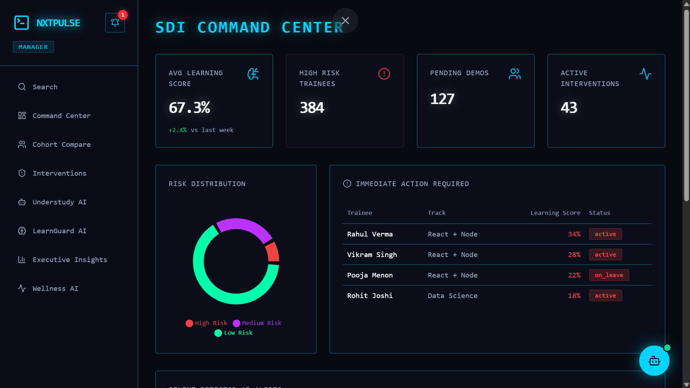
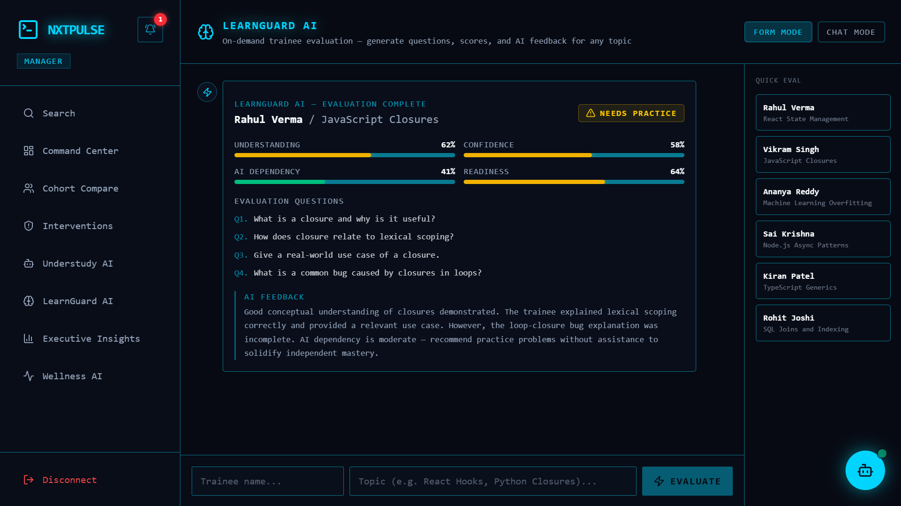
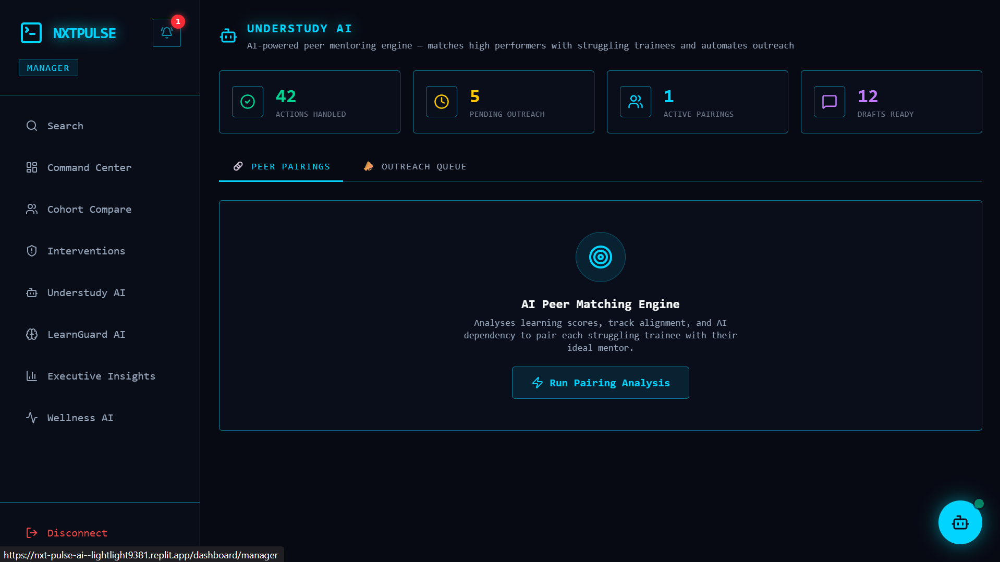
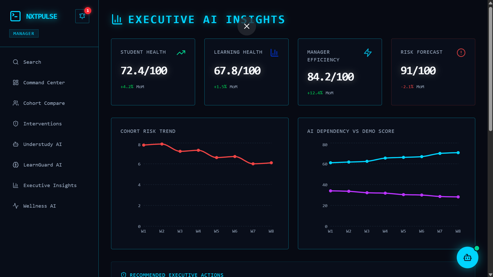
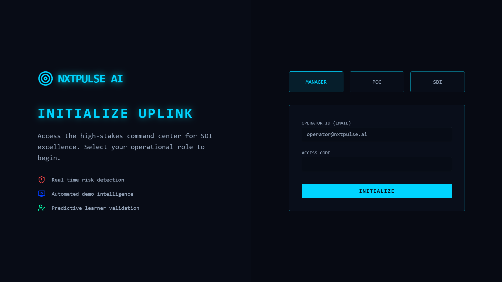
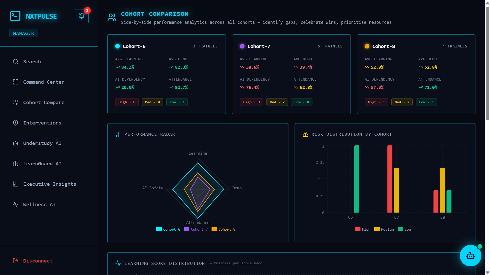
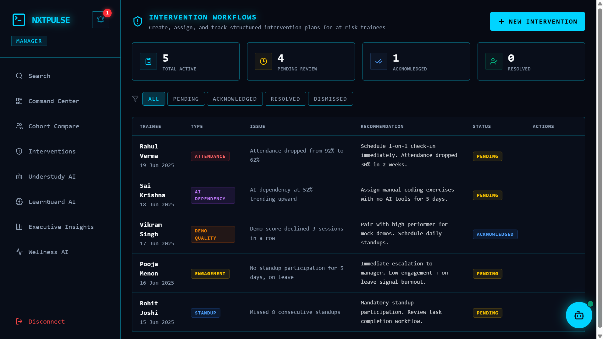
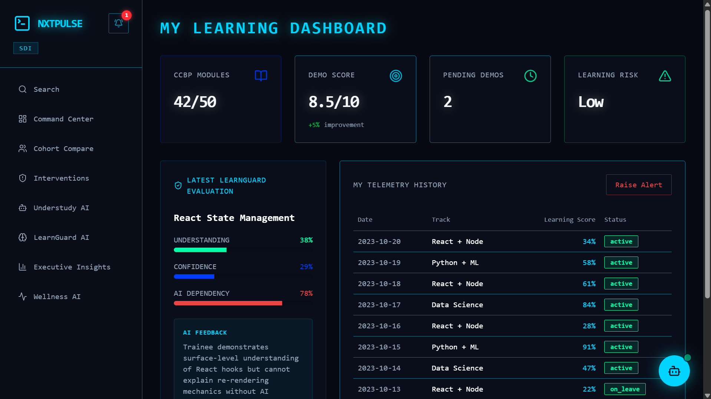

# NxtPulse AI 🚀

## AI-Powered Trainee Intelligence Platform




---

# 🌐 Live Demo

🚀 **Hosted Application:**
https://nxt-pulse-ai--lightlight9381.replit.app/

🔗 **GitHub Repository:**
https://github.com/sainadhkari/NxtPulse-AI
https://github.com/saicharanvanam/NxtPulse-AI

---

# ✨ Quick Highlights

✅ Full-Stack AI SaaS Platform
✅ Role-Based Authentication
✅ Real-Time AI Insights
✅ PostgreSQL Data Persistence
✅ Hosted Live on Replit
✅ 10+ Advanced Features

---

> ## Key Innovation
>
> NxtPulse transforms raw trainee data into intelligent AI-driven decisions.

---

# 🚨 Problem Statement

Modern learning ecosystems and training programs struggle to effectively monitor trainee performance at scale.

Managers often handle large numbers of trainees across multiple cohorts, making it difficult to monitor each trainee’s progress in real time.

Traditional systems rely heavily on manual tracking of:

* Attendance
* Learning Progress
* Demo Performance
* Engagement
* Confidence Levels
* AI Dependency

This creates major challenges:

* Hidden struggling trainees remain unnoticed
* Delayed interventions reduce recovery chances
* AI dependency impacts actual learning quality
* Low confidence affects demo performance
* Burnout and stress remain untracked
* Mentorship allocation becomes inefficient

Most existing dashboards only display static metrics but fail to provide intelligent insights, predictive analytics, or actionable recommendations.

As a result, managers often react too late.

---

# 💡 Why NxtPulse?

NxtPulse was built to transform trainee monitoring from a reactive process into a proactive AI-driven system.

Instead of simply displaying metrics, NxtPulse continuously analyzes trainee signals and converts them into intelligent insights.

It enables:

* Early Risk Detection
* AI-Powered Evaluation
* Predictive Analytics
* Smart Interventions
* Mentor Recommendations
* Wellness Monitoring
* Executive-Level Decision Support

---

# ⚡ Solution Overview

NxtPulse transforms raw trainee data into actionable intelligence.

The platform continuously analyzes:

* Learning Performance
* Attendance Trends
* Demo Performance
* Confidence Levels
* AI Dependency
* Behavioral Signals

Using AI-powered analytics and evaluation engines, NxtPulse identifies risks early, recommends interventions, improves mentorship efficiency, and helps organizations improve trainee outcomes.

---

# 🔄 How NxtPulse Works

NxtPulse follows a 4-stage intelligence workflow.

---

## 📥 Detect

The system continuously collects trainee signals:

* Learning Scores
* Attendance
* Demo Performance
* AI Dependency
* Engagement
* Confidence

---

## 🧠 Analyze

AI modules process this data to identify:

* Risk Patterns
* Weak Learning Areas
* Behavioral Changes
* Burnout Indicators

---

## 🎯 Intervene

The system recommends:

* Intervention Plans
* Peer Mentoring
* Learning Improvements
* Manager Actions

---

## 📈 Improve

Continuous monitoring improves:

* Learning Quality
* Confidence
* Performance
* Engagement

---

# Workflow Summary

## 📥 Detect → 🧠 Analyze → 🎯 Intervene → 📈 Improve

---

# 🤖 Core AI Modules

---

## 🤖 NxtPulse GPT

AI-powered assistant for managers and mentors.

Provides real-time insights using natural language interaction.

Example queries:

* Who are the highest-risk trainees?
* Summarize Cohort-7
* Recommend interventions for Rahul

---

## 🧠 LearnGuard AI

AI-powered trainee evaluation engine.

Evaluates:

* Understanding
* Confidence
* AI Dependency
* Readiness

Generates:

* Dynamic Questions
* Evaluation Scores
* AI Feedback



---

## 🔍 Silent Detector AI

Detects hidden struggling trainees using behavioral signal analysis.

Tracks:

* Attendance Drops
* Demo Performance Decline
* Low Engagement
* High AI Dependency

---

## 🤝 Understudy AI

AI-driven peer mentoring engine.

Matches struggling trainees with high-performing mentors based on:

* Compatibility Score
* Skill Alignment
* Performance Level
* AI Dependency



---

## ❤️ Wellness AI

Monitors trainee wellness.

Tracks:

* Stress
* Burnout Risk
* Motivation Trends

---

## 📊 Executive AI Insights

Provides high-level strategic intelligence.

Includes:

* Risk Forecasting
* Trend Analysis
* Cohort Comparison
* Strategic Recommendations



---

# ⚙️ Complete Functionalities

* Role-Based Authentication
* Manager Dashboard
* POC Dashboard
* SDI Dashboard
* Cohort Comparison
* LearnGuard AI
* Silent Detector AI
* Understudy AI
* Intervention Workflows
* Wellness AI
* Executive Insights
* NxtPulse GPT
* Global Search
* Real-Time Notifications
* PDF Export

---

# 🖼️ Application Screenshots

## Landing Page



---

## Manager Dashboard


---

## Cohort Comparison



---

## LearnGuard AI


---

## Understudy AI


---

## Intervention Workflow



---

## Trainee Profile



---

## Executive Insights


---

# 🛠️ Tech Stack

| Layer    | Technologies                                               |
| -------- | ---------------------------------------------------------- |
| Frontend | React, TypeScript, Tailwind CSS, Vite                      |
| Backend  | Node.js, Express.js                                        |
| AI       | LLM API Integration, AI Risk Scoring, Predictive Analytics |
| Database | PostgreSQL                                                 |

---

# 📂 Project Structure

```bash
artifacts/
├── nxtpulse/        # Frontend Application
├── api-server/      # Backend Services
```

---

# 🚀 Installation

```bash
git clone <repository-url>
cd NxtPulse-AI
pnpm install
pnpm dev
```

---

# 🌍 Use Cases

NxtPulse can be used by:

* EdTech Platforms
* Training Institutes
* Bootcamps
* Universities
* Corporate Learning Programs

---

# 📈 Business Impact

NxtPulse helps organizations move from reactive trainee monitoring to proactive AI-driven intervention.

Key Benefits:

* Early Risk Detection
* Better Mentorship
* Reduced AI Dependency
* Improved Learning Outcomes
* Higher Manager Productivity

---

# 🔮 Future Scope

* Mobile Application
* LMS Integration
* Advanced Predictive Models
* Real-Time Analytics Pipelines
* Automated Intervention Scheduling

---

# 🏁 Final Impact

## Detect → Analyze → Intervene → Improve

NxtPulse transforms raw trainee data into intelligent decisions.

---

# 👥 Team Members
* Sainadh Kari
* Saicharan Vanam

Hackathon 1.0 Submission — NxtPulse AI 🚀
